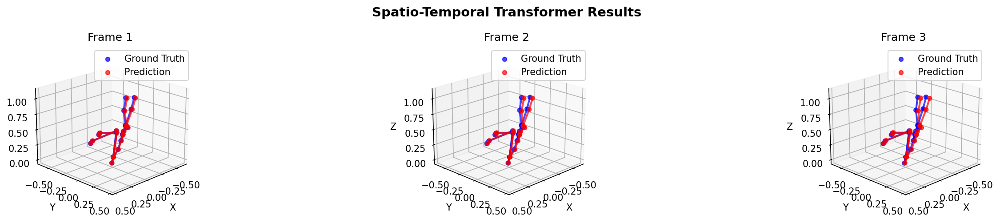
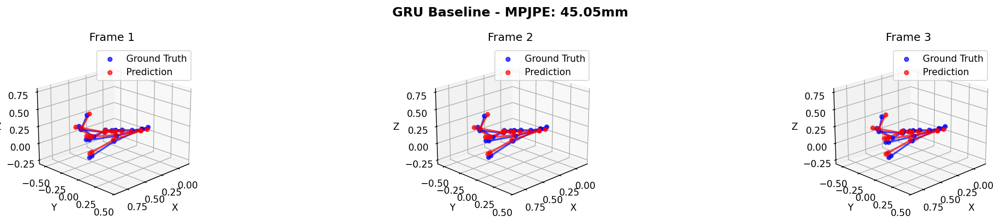

# Human Motion Prediction with Spatio-Temporal Transformers

This repository contains code for short-horizon human motion prediction using PyTorch.  
The models are trained and evaluated on the AMASS dataset.

---

## What this project does

Given a short sequence of past human motion, the model predicts a few future frames.

- Past input: 25 frames (1 second)
- Future prediction: 5 frames (200 ms)
- Output: joint rotations + root translation

The main goal is to compare a transformer-based model with a GRU baseline under the same setup.

---

## Models

### Spatio-Temporal Transformer

- Transformer model with separate temporal and spatial attention
- Temporal attention is applied per joint
- Spatial attention is constrained using the SMPL skeleton
- Uses 6D rotation representation
- Predicts future frames autoregressively

### GRU Baseline

- GRU encoder over the input sequence
- Separate decoders for pose and root translation
- Uses the same data representation and loss as the transformer

---
## Experimental Setup

- Dataset: AMASS
- Input frames: 25
- Output frames: 5
- Joints: 22 (SMPL)
- Training epochs: 20 for both models
- Metrics: MPJPE (mm), FDE (mm)

Both models are trained under identical optimization settings for a fair comparison.

---

| Model           | MPJPE (mm) |
|-----------------|------------|
| GRU Baseline    | ~104       |
| ST-Transformer  | ~96        |

## Acknowledgments 
- AMASS dataset for motion capture data
- SMPL body model for skeletal representation
- This project was inspired by the Motion Transformer work from ETH Zurich:
  https://ait.ethz.ch/motiontransformer
